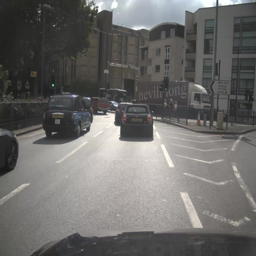
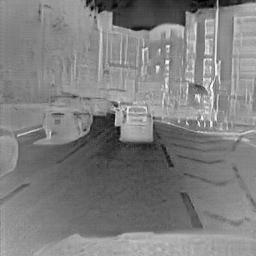
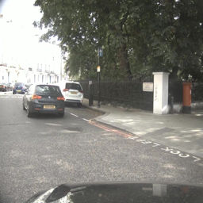
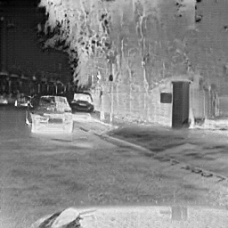
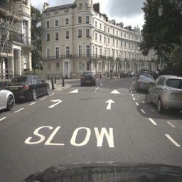
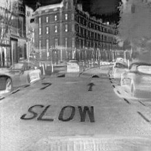
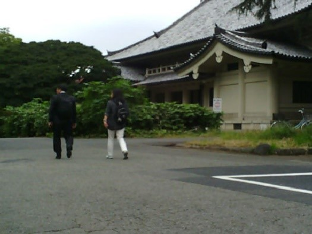
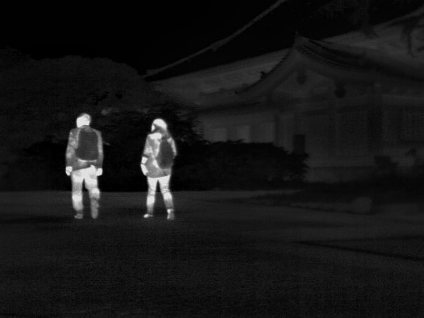
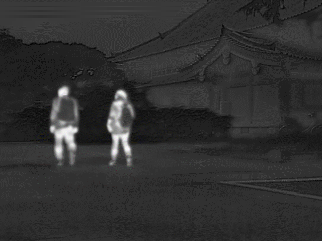
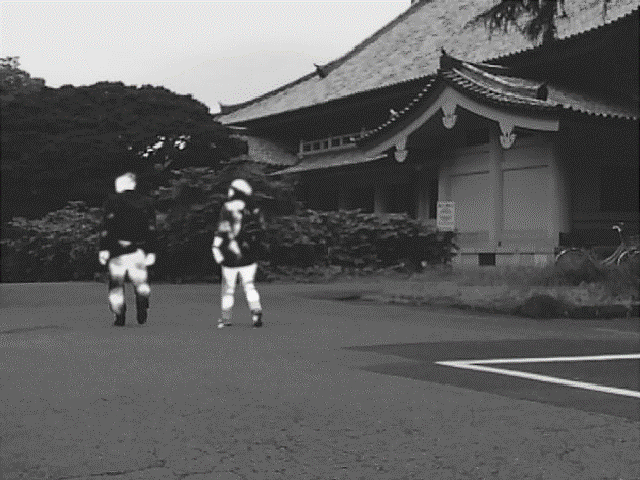

# Infrared images generation and image fusion

## Introduction
Thermal cameras are expensive and have a narrow field of view, resulting in a lack of infrared image datasets at present. Therefore, utilizing rich and diverse visible light to generate infrared images is of great importance. This project utilizes existing visible and infrared image data to train generate adversarial networks. Based on the characteristics of the task of generating infrared images from visible light, this project has added content loss, and the generation effect is improved by referencing Transformer's self loss on the basis of adversarial loss and cyclic consistency loss. In addition to using visible light to generate infrared images in augmenting the number of infrared data, image fusion technology can also be used to enhance the image quality of infrared image data.

## Demo
### Infrared image generation 
 

 

 

The images at the left are visible light images taken with camera and the images at the right are infrared images generated by the network.
### Image fusion

  

  

The images in the first row are original visible light image and infrared image.

The images in the second row are fused images by FusionGAN and STDFusionNet.

## Instruction

### Datasets
[Download Free ADAS Dataset v2 - Teledyne FLIR](https://adas-dataset-v2.flirconservator.com/#downloadguide)
### File Introduction
**data** is meant to construct the dataset.

**models** is meant to make the network ,set the loss function and complete backpropagation according to Algorithm.

**options** is meant to set the basic hyperparameters.

**result image** is meant to save the result images.

**util** is meant to build some supplementary funtions.

## Algorithm Explanation
The original image from the X domain can be generated by the G generator to generate an image similar to the destination source Y domain. The image will pass the specified special discriminator to determine the authenticity of the image. In addition, the generated image will also pass the F generator. Return to the X domain, and then use cycle-consistent loss so that the image can maintain the basic information of the original image when generating the Y domain. In the same way, images from the Y domain are similarly operated as images from the X domain.

Based on the loss function of CycleGAN, I added two kinds of loss according to the characteristic of thermal infrared generation. 

Firstly, a real image X first uses the generating network G to obtain the generated false image G(X), and then uses the generating network F(G(X)) to return a picture similar to the real image. Different from the original cyclic consistent loss, here I will first use the trained VGG16 network to extract advanced features of the two images. The L1 loss is then used to calculate the difference between the two images.

Secondly, transformer has a very important setting, the multi-head self-attention mechanism, in which each word vector will have three vectors Q, K, V, where Q is the query vector and K is the key vector. The similarity is obtained by vector multiplication, and finally the value vector is weighted to obtain the final output vector.
Drawing on this idea, I used pre-trained networks to extract features from both the original images and the generated images, and extracted feature layers from networks of different depths as comparison objects. Then a certain number of patches are selected from different feature layers, each patch is compressed into a one-dimensional vector, which is used as a K vector, and the pixel point in the upper left corner of each patch is used as a Q vector, and the similarity is calculated to obtain a similarity matrix. Finally, the cosine similarity calculation and a matrix of all 1s of the same dimension are used to calculate the L1 loss to obtain the final self loss.
